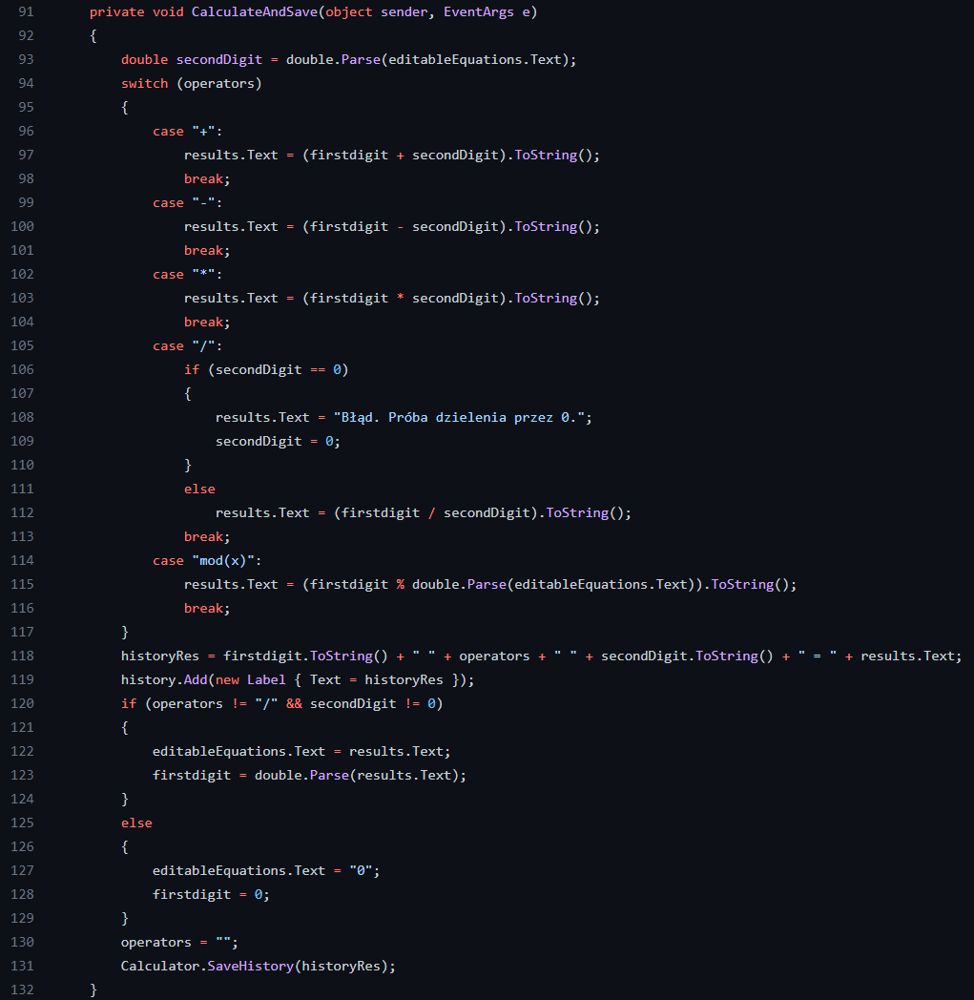

# Dokumentacja program Kalkulator
Autor: Alicja Janeczko 4G

___

## Budowa i funkcjonalości programu:

___

* CalculatorPage.xaml.cs:
  * void WriteHistory()
  * void OnNumberClicked()
  * void ClearLastChar()
  * void OnClear()
  * void OnChangeSign()
  * void OnSelectOperator()
  * void CalculateAndSave()
  * void OnLog()
  * void OnAbsolute()
  * void OnRoot()
  * void OnSin()
  * void OnCos()
  * void OnPi()
  * void OnPower()
  * void OnDenominator()
  * void OnPercentage()
* Calculator.cs:
  * void SaveHistory(string)

___

## Opisy funkcji

___

### WriteHistory()
To funcja typu void, znajdująca się w pliku CalculatorPage.xaml.cs. Odpowiada za:
* Stworzenie nowego obiektu StreamReader i ustawienia ścieżki do pliku "history.txt" w folderze Documents użytkownika.
* Odczytanie każdego wiersza tekstu z pliku i dodanie go do obiektu Label z tekstem wiersza jako jego etykietą.

___

### OnNumberClicked()
To funcja typu void, znajdująca się w pliku CalculatorPage.xaml.cs. Odpowiada za:

* Sprawdzenie, czy tekst w editableEquations jest równy "0" lub czy istnieje operator. Jeśli tak, to kod ustawi tekst w editableEquations jako pusty. Jeśli nie, to doda to, co zostało kliknięte do tekstu.

___

### ClearLastChar()
To funcja typu void, znajdująca się w pliku CalculatorPage.xaml.cs. Odpowiada za:

* Usuwanie po jednym znaku z ciągu znaków w równaniu
* Jeśli w róznaniu nie ma żadnego znaku, ustawienie jego wartości na 0

___

### OnClear()
To funcja typu void, znajdująca się w pliku CalculatorPage.xaml.cs. Odpowiada za:

* Przypisanie równianu wartości początkowej (0)
 

___

### OnChangeSign()
To funcja typu void, znajdująca się w pliku CalculatorPage.xaml.cs. Odpowiada za:

* Zmianie znaku równania na przeciwny i wyświetlenie go jako wynik działania

___

### OnSelectOperator()
To funcja typu void, znajdująca się w pliku CalculatorPage.xaml.cs. Odpowiada za:

* Sprawdzenie, czy użytkownik wpisał liczbę w editableEquations.Text. Jeśli tak, to kod przetwarza tę liczbę i przypisuje ją do firstdigit.
* Przypisuje warość wybranego operatora do zmiennej, w której będzie przechowywany pod warunkiem, że nie jest on "-", a w równanie nie jest puste

___

### CalculateAndSave()
To funcja typu void, znajdująca się w pliku CalculatorPage.xaml.cs. Odpowiada za:

* Obliczenie równania w zależności od wybranego operatora: +, -, *, / lub % (modulo)
* Dodanie do historii obliczeń równania i wywołanie funkcji **SaveHistory(string)** z argumentem, który jest ciągiem znaów zawierającym równanie
* Zabezpieczenie przed próbą podzielenia przez 0
* Wyzerowanie zmiennych
  

___

### Funkcje kalkulatora naukowego
* **OnLog()**: Oblicza logarytm o podstawie 10 z liczby
* **OnAbsolute()**: Oblicza wartość bezwzględną z liczby
* **OnRoot()**: Oblicza pierwiastek drugiego stopnia z liczby
* **OnSin()**: Oblicza sinus równania
* **OnCos()**: Oblicza cosinus równania
* **OnPi()**: Ustawia wartość liczby w równaniu na liczbę pi
* **OnPower()**: Oblicza potęgę kwadratową z liczby
* **OnDenominator()**: Oblicza ułamek, gdzie licznikiem jest 1 a mianowanikiem liczba z równania
* **OnPercentage()**: Zamienia procent na liczbę
* Wszystkie powyższe funkcje dodają wynik do historii obliczeń równania i wywołują funkcję **SaveHistory(string)** z argumentem, który jest ciągiem znaków zawierającym równanie
___

### SaveHistory(string)
To funcja typu void, znajdująca się w pliku Calculator.cs i przyjmująca jako argument zmienną string, w której jest przechowywane równanie. Odpowiada za:

* Utworzenie pliku o nazwie "history.txt" w folderze Moje dokumenty użytkownika, a następnie wpisze do tego pliku zawartość zmiennej history.
 

___

### Przykładowe działanie programu: 

* Odejmowanie  
https://user-images.githubusercontent.com/67004275/208858077-e055f055-6043-4bf5-8986-55237992124d.mp4

* Mnożenie  
https://user-images.githubusercontent.com/67004275/208857706-714954fc-b0d8-4fd8-80dd-d821d602e7ed.mp4

* Próba dzielenia przez 0  
https://user-images.githubusercontent.com/67004275/208857763-3eadf2e6-0716-47c1-b79f-59cf989c013d.mp4

* Historia obliczeń po otwarciu i zamknięciu programu  
https://user-images.githubusercontent.com/67004275/208857793-942ee96f-6a6b-4508-87c2-2b302634b2b3.mp4

* Logarytm  

___
